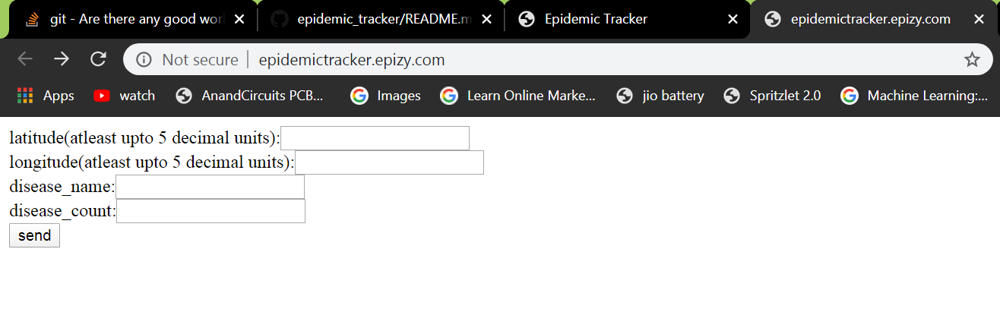

# epidemic_tracker
A website which can be used to track the affect of a epidemic out-break in RealTime. And the locations and the number of patients infected will be visualized on the map.

# Implementation
1. I have used open-source hosting platform to host my entire site and databases
2. I have used Yandex map API to visualize the map on my site
3. I have used OneSignal API to send  Notifications to the subscribers

# Things you need to do 
 1.If you are running locally install wamp or xamp.
 2.Change your hostname,database_name and password in the php files.
 3.you have import my database schema which .sql file given above.
 
 # How it works
 The hostipals use our website to enter the data like name_of_Disease,NUmber_of-patients and their loaction(Lattitude & Longitude).
 The Details will be updated on the map.
 User can Subscribe to our site to get personalized Notifications.
 
# ScreenShots

